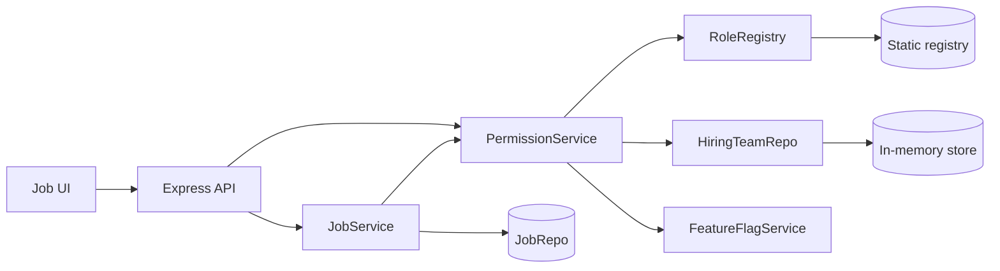
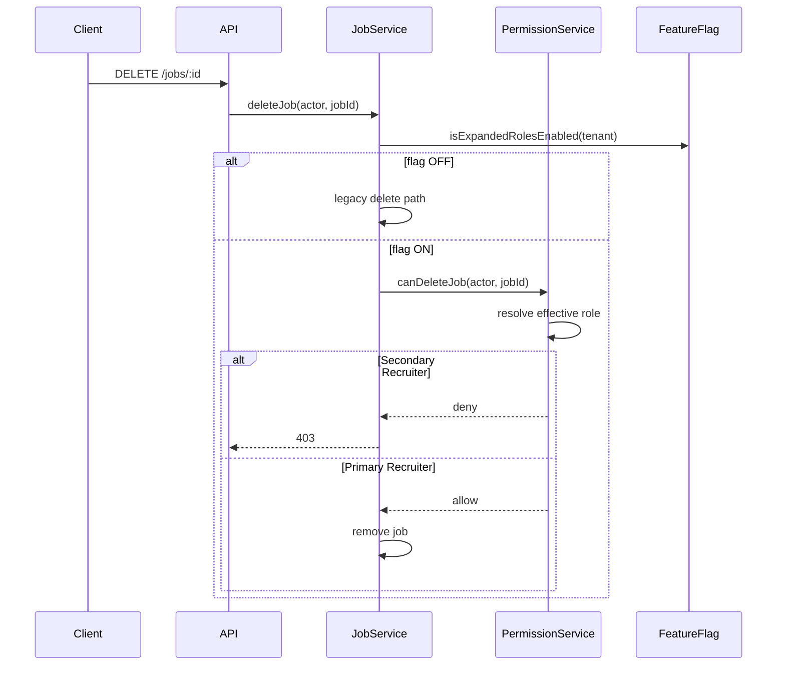
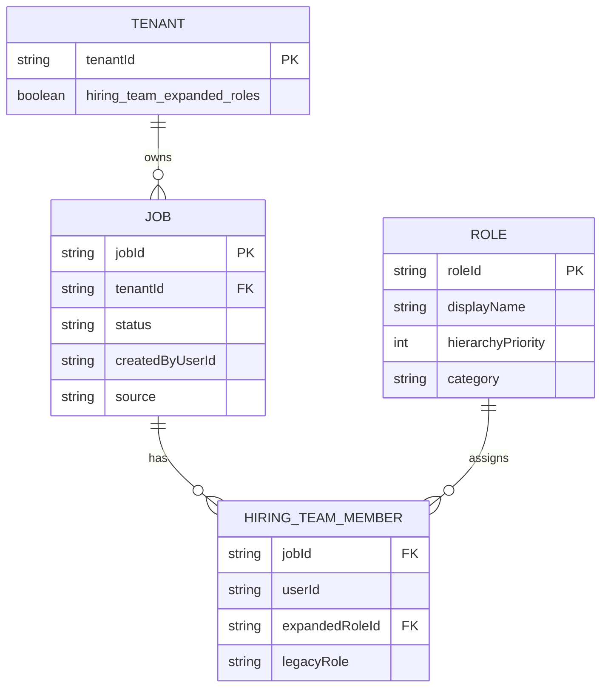

# Design — Secondary Recruiter Role & Job Lifecycle Permission Enforcement

> Produced from the **approved** `spec.md`. Requirements gate signed off 2026-06-24.

## 1. Approach

Build a **TypeScript reference service** in NorthStarCheck that models the minimum CRM surfaces needed to prove REQ-001–010: a role registry, hiring-team memberships on jobs, a feature-flag gate, a centralized authorization function for delete/close, job lifecycle handlers, and a thin HTML UI that reflects permission state.

**Chosen approach:** in-process modules + Express HTTP API + in-memory repositories, tested with Vitest integration tests.

**Alternatives rejected:**
- **Full CRM monolith stub** — too heavy for a reference repo; rejected.
- **Permissions only in UI** — violates NFR-001; rejected.
- **`createdBy`-based ownership** — contradicts human-confirmed rule B; rejected.

The authorization rule is a single pure function: given `(tenantFlag, actorId, jobId)` → resolve the actor's **effective job-level role** on that job (highest `hierarchyPriority` when multiple assignments exist) → allow delete/close only if effective role is Primary Recruiter when flag is ON; when flag is OFF, skip expanded-role checks and use legacy allow path.

## 2. Architecture / data flow



**Components:**

| Module | Responsibility | Satisfies |
|--------|----------------|-----------|
| `src/roles/registry.ts` | Static Primary/Secondary definitions, legacy `Recruiter` → Primary resolution | REQ-001, REQ-002 |
| `src/roles/feature-flags.ts` | Per-tenant `hiring_team_expanded_roles` lookup | REQ-007 |
| `src/jobs/hiring-team.ts` | Membership CRUD, effective-role resolver (max `hierarchyPriority`) | REQ-009, REQ-010 |
| `src/permissions/job-lifecycle.ts` | `canDeleteJob`, `canCloseJob`, `canCreateJob` | REQ-003–006, REQ-010 |
| `src/jobs/job-service.ts` | Create (template/blank/clone), delete, close orchestration | REQ-003–006 |
| `src/api/routes.ts` | REST endpoints, 401/403 mapping | NFR-001, NFR-002 |
| `src/ui/job-actions.html` | Disable/hide delete & close for Secondary | REQ-008 |
| `tests/integration/**` | Flag on/off, Primary/Secondary matrix, UI + API | All REQs, NFR-004 |

**Delete/close request sequence:**



## 3. Data model changes



**Registry seed (static):**

| roleId | displayName | hierarchyPriority | category |
|--------|-------------|-------------------|----------|
| `primary-recruiter` | Recruiter (Primary) | 100 | Leading |
| `secondary-recruiter` | Secondary Recruiter | 50 | Supporting |

Legacy field `legacyRole = "Recruiter"` dual-written on Primary assignments (REQ-002).

**Job `source` enum:** `template` | `blank` | `clone` — distinguishes create paths for REQ-003 tests only; authorization does not differ by source.

No persistence layer beyond in-memory maps for the reference implementation. Production would add DB migrations per PHEM-2109151 FRD; out of scope here.

## 4. API / interface changes

| Method | Endpoint | Auth | Behavior |
|--------|----------|------|----------|
| `GET` | `/api/roles/registry` | session | Returns registry when flag ON; 404 or legacy subset when OFF |
| `POST` | `/api/jobs` | session | Body: `{ source: "template"\|"blank"\|"clone", cloneFromJobId? }` — REQ-003 |
| `DELETE` | `/api/jobs/:jobId` | session | 403 if Secondary (flag ON); 200 if Primary or legacy (flag OFF) |
| `POST` | `/api/jobs/:jobId/close` | session | Same authorization as delete |
| `GET` | `/api/jobs/:jobId/permissions` | session | `{ canDelete, canClose, effectiveRole }` — drives REQ-008 UI |
| `POST` | `/api/jobs/:jobId/hiring-team` | session | Assign member with `expandedRoleId` (test setup) |

**`PermissionService` interface (internal):**

```typescript
canDeleteJob(ctx: AuthContext, jobId: string): boolean
canCloseJob(ctx: AuthContext, jobId: string): boolean
canCreateJob(ctx: AuthContext): boolean  // always true for recruiter-family when flag ON
resolveEffectiveRole(ctx: AuthContext, jobId: string): Role | null
```

Backward compatibility: when `hiring_team_expanded_roles` is false, `resolveEffectiveRole` is not called for delete/close; legacy path treats any `legacyRole === "Recruiter"` membership as authorized (REQ-007).

## 5. Impact on existing behavior (the `amends` detail)

This reference implementation has no prior code. Conceptually it **amends** the undifferentiated Recruiter model:

- **Before:** any hiring-team Recruiter can delete/close.
- **After (flag ON):** only Primary Recruiter can delete/close; Secondary is denied.
- **After (flag OFF):** unchanged legacy behavior.

Living-layer docs to create on ship: `northstar/steering/product.md` (recruiter-family roles), `northstar/steering/tech.md` (stack + module layout), `northstar/steering/structure.md` (directory conventions).

## 6. Risks & mitigations

| Risk | Mitigation |
|------|------------|
| Effective-role resolver mis-picks when user has multiple memberships | Unit tests for REQ-009; `hierarchyPriority` comparison is explicit and documented in registry |
| Flag OFF path accidentally reads expanded fields | `FeatureFlagService` checked first in `JobService`; dedicated regression test suite (NFR-004) |
| UI-only gating without server enforcement | Delete/close routes always call `PermissionService`; UI reads `/permissions` endpoint (REQ-008) |

## Changelog

- v0.1.0 — 2026-06-24 — initial design — pending PR
