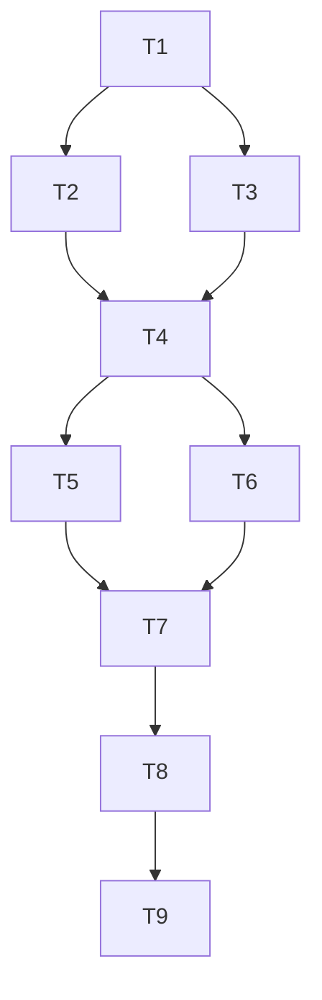

# Tasks — Secondary Recruiter Role & Job Lifecycle Permission Enforcement

> Dependency-aware build plan for `/ns-implement`. Design gate signed off 2026-06-24.

## Task graph

- **T1** — Project bootstrap (TypeScript, Express, Vitest, package scripts)
  - *Depends on:* none
  - *Files:* `package.json`, `tsconfig.json`, `vitest.config.ts`, `src/index.ts`, `.gitignore`, `README.md`
  - *Satisfies:* (foundation)
  - *Done when:* `npm test` runs (empty suite passes) and `npm run build` compiles without errors

- **T2 [P]** — Role registry + legacy resolution
  - *Depends on:* T1
  - *Files:* `src/roles/registry.ts`, `src/roles/types.ts`, `tests/unit/registry.test.ts`
  - *Satisfies:* REQ-001, REQ-002
  - *Done when:* Unit tests assert Primary + Secondary roles with stable IDs/categories and legacy `Recruiter` → Primary resolution with display label preserved

- **T3 [P]** — Feature flags + in-memory repositories
  - *Depends on:* T1
  - *Files:* `src/roles/feature-flags.ts`, `src/jobs/job-repo.ts`, `src/jobs/hiring-team.ts`, `src/auth/types.ts`, `tests/unit/feature-flags.test.ts`, `tests/unit/hiring-team.test.ts`
  - *Satisfies:* REQ-007 (flag service), REQ-009 (effective-role resolver)
  - *Done when:* Unit tests cover flag on/off per tenant and `resolveEffectiveRole` picks highest `hierarchyPriority` when user has both Primary and Secondary on same job

- **T4** — Permission service (job lifecycle authorization)
  - *Depends on:* T2, T3
  - *Files:* `src/permissions/job-lifecycle.ts`, `tests/unit/job-lifecycle-permissions.test.ts`
  - *Satisfies:* REQ-004, REQ-005, REQ-006, REQ-007, REQ-009, REQ-010, NFR-001
  - *Done when:* Unit tests prove Secondary denied delete/close (flag ON), Primary allowed, flag OFF uses legacy path, Secondary who created job still denied, Primary who didn't create allowed

- **T5 [P]** — Job service (create / delete / close)
  - *Depends on:* T4
  - *Files:* `src/jobs/job-service.ts`, `tests/integration/job-service.test.ts`
  - *Satisfies:* REQ-003, REQ-004, REQ-005, REQ-006
  - *Done when:* Integration tests cover create-from-template, create-blank, create-clone by Secondary; delete/close matrix for Primary vs Secondary

- **T6 [P]** — Express API routes + auth middleware
  - *Depends on:* T4
  - *Files:* `src/api/routes.ts`, `src/api/middleware.ts`, `src/api/errors.ts`, `tests/integration/api.test.ts`
  - *Satisfies:* REQ-003–007, NFR-001, NFR-002
  - *Done when:* API tests return 401 without session, 403 for Secondary delete/close, 200 for Primary; registry endpoint returns roles when flag ON

- **T7** — Wire server entrypoint + permissions endpoint
  - *Depends on:* T5, T6
  - *Files:* `src/index.ts`, `tests/integration/server.test.ts`
  - *Satisfies:* REQ-001, NFR-003
  - *Done when:* Server starts, `/api/jobs/:id/permissions` returns `{ canDelete, canClose, effectiveRole }`; p95 role-lookup overhead ≤ 5 ms in harness benchmark test

- **T8** — Job actions UI (disable/hide delete & close)
  - *Depends on:* T7
  - *Files:* `src/ui/job-actions.html`, `src/ui/job-actions.js`, `tests/integration/ui-permissions.test.ts`
  - *Satisfies:* REQ-008
  - *Done when:* UI test shows delete/close disabled for Secondary; direct API call without UI still returns 403

- **T9** — Flag-off regression suite + living-layer docs
  - *Depends on:* T8
  - *Files:* `tests/integration/legacy-regression.test.ts`, `northstar/steering/product.md`, `northstar/steering/tech.md`, `northstar/steering/structure.md`
  - *Satisfies:* NFR-004, constitution §8
  - *Done when:* Regression tests pass with flag OFF (legacy delete/close/create unchanged); steering docs describe current role model and module layout; full `npm test` green

## Living-layer updates (constitution §8)

- **T9** — Create `northstar/steering/product.md`, `tech.md`, and `structure.md` documenting recruiter-family roles, TypeScript/Express stack, and `src/` layout. *Depends on:* T8.

## Changelog

- v0.1.0 — 2026-06-24 — initial tasks — pending approval
