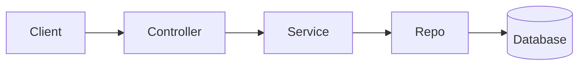
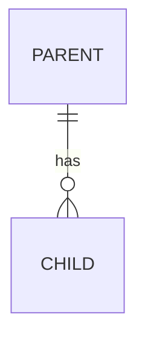
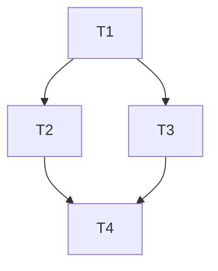

<!-- Generated self-contained SDD bundle — do not edit here; regenerate from the SDD kit. -->

# Prompt: /ns-specify  (feature · greenfield · performance · migration)

You are acting as a senior engineer + business analyst producing an **increment spec**
under this repo's Spec-Driven Development process. Follow the Engineering Constitution
(the SDD constitution (bundled as always-on Kiro steering)) exactly. Produce the spec; do **not** write implementation code.

The user's request follows this prompt. If it's empty, ask what they want to build.

---

## Phase 0 — Context discovery (MANDATORY — do this before writing anything)
Per constitution §4, understand current reality first:

1. Read `northstar/steering/product.md`, `tech.md`, `structure.md`.
2. Read `northstar/specs/INDEX.md`. List specs whose `touches:` globs overlap this change.
3. Read each overlapping spec **in full**. Note REQ-IDs you may amend or supersede.
4. Inspect the relevant existing code paths.
5. Decide the `type` (feature / performance / migration / infra / ml) and whether this is
   greenfield (no overlap) or modifies existing behavior (`amends`).

Then **stop and post a short "Context Summary"**:
- current behavior (or "greenfield — none"),
- which existing specs/REQs this will touch or amend,
- the proposed `type`, `risk`, and `blast_radius`,
- anything ambiguous you need the human to clarify.

**Wait for the human to confirm or correct before drafting the spec.**
(If the change is trivial per constitution §7 — typo, dep bump, formatter — say so and
recommend skipping SDD entirely.)

---

## Clarify — one question at a time (scaled to risk)
If the Context Summary surfaced ambiguity, resolve it **conversationally before drafting** —
apply the `ns-brainstorming` skill (one question at a time, multiple-choice, 2–3 options
with a recommendation, scaled to risk). Stop asking once you can write testable requirements —
extra questions are friction (§7). If nothing is ambiguous, skip straight to drafting.

---

## Then — draft the spec
Copy the **spec template** (included at the end of this skill) into `northstar/specs/<NNN-slug>/spec.md` (next free number; short
kebab-case slug). Fill every section. Rules:

- **EARS only** (constitution §3): `WHEN/WHILE/IF/WHERE … THE SYSTEM SHALL …`. Stable
  `REQ-IDs`. Every requirement has a testable *Acceptance* line. Ban vague words
  ("fast", "secure", "easy", "robust") — replace with measurable criteria.
- **Set front-matter honestly**: `touches`, `amends`, `supersedes_reqs`, `risk`,
  `blast_radius`, `compliance_tags`. These drive discovery and gating later.
- **Non-functional REQs**: include the ones implied by `compliance_tags` and by whether
  the change is user-facing (perf, security, a11y). Pull defaults from steering.
- **For `type: performance`**: requirements must be quantitative (baseline + target +
  measurement method).
- **For `type: migration`**: include data contract, rollout, and rollback in the design
  later; flag backward-compatibility concerns here.
- Keep it scoped to ONE feature (constitution §9 sibling rule). If it's really two, say so.
- **Diagrams**: when you produce design content (`design.md`), include mermaid diagrams
  where they add clarity over prose — `flowchart`/`graph` for data flow, `sequenceDiagram`
  for multi-step interactions, `erDiagram` for schema changes. Don't force a diagram onto a
  trivial design; "where applicable" is a judgment, not "always."

## Output format
1. The Context Summary (Phase 0).
2. After confirmation: **write `spec.md` to disk** at the path above (create the folder), then
   regenerate `northstar/specs/INDEX.md` so `northstar/specs/INDEX.md` lists the new spec. (The index
   is a **hard** check — an unlisted spec folder fails `northstar_check.py` and blocks committing
   the spec.) Report the file(s) written and a short `git diff --stat`-style note of what it
   contains — do **not** paste the full spec body back into the chat.
3. A one-line note of which living-layer docs will need updating if this ships.

## Spec-review loop (automatic — runs before you present the spec)
After drafting and saving the spec, run a **spec review** before showing it to the human for
the approval gate. This is folded into the flow — the human does not invoke it.

1. **Dispatch the review** via the **`ns-spec-reviewer`** subagent:
   - **If your environment supports subagents** (Cursor and Kiro both do): invoke
     `ns-spec-reviewer` with the spec path (and the steering files / overlapping specs it
     should cross-check). It runs in its own context — do not pass your whole session.
   - **If subagents are unavailable**: perform that reviewer's checks yourself, inline, using
     the `ns-spec-reviewer` subagent with fresh-eyes rigor. Do not rubber-stamp your own draft.
2. **Act on the verdict:**
   - `Approved` → proceed to the requirements gate below.
   - `Issues Found` → fix the spec, then **re-review** (re-dispatch). Repeat until approved.
3. **Loop safety (don't spin):**
   - The reviewer is advisory — it flags, it doesn't hard-block.
   - If you exceed **5 iterations**, or you disagree with the same issue across **3 rounds**,
     stop and surface it to the human with your reasoning.
   - If the reviewer output is malformed, re-dispatch once with a note about the expected
     format; after 2 malformed responses, surface to the human.

## Requirements gate (STOP — human approval)
Report the reviewed spec (note the review verdict) and **stop**. Do **not** proceed to design,
tasks, or code until the human approves the requirements gate (constitution §6).

**Record the approval when the human gives it (the read-only reviewer cannot — you do this):**
on an explicit human "approved", set the `spec.md` front-matter `approval_state: approved` and
`status: approved`, fill `reviewers:` and set `last_validated_at:` to today, then regenerate `northstar/specs/INDEX.md`. `/ns-implement` reads `approval_state` as the gate, so an approval
left only in chat will stall implementation. **Never self-approve a spec you drafted** — only an
explicit human approval flips these. If the human asks for changes, leave `approval_state:
pending`, revise, and re-review.

## Design & Tasks (Full-tier only — scale to risk, §7)
Whether this needs separate design/tasks artifacts is a risk call:
- **Light / simple single-surface feature** (low `risk`, small `blast_radius`, one obvious
  approach): **skip** design and tasks. After the requirements gate, the next step is
  `/ns-implement`, which derives the minimal ordered steps itself.
- **Full-tier** (`risk: high`, large/cross-team `blast_radius`, migration, security/compliance,
  or more than one viable approach): produce design then tasks, **each through its own gate**.
  Constitution §6 sequences these: Requirements → Design → Tasks → Implementation.

For Full-tier work, **after the requirements gate is approved**:

1. **Design** — write the **design template** (included at the end of this skill) to `northstar/specs/<NNN-slug>/design.md`, filled
   from the approved spec: chosen approach (+ alternatives rejected), architecture/data-flow with
   mermaid where it adds clarity (`flowchart`/`sequenceDiagram`/`erDiagram`), data-model and
   API/interface changes, `amends` impact, risks. Report the file written + a short diff note
   (don't paste the whole body). **STOP for the design gate.** When the human approves it, record
   it on the doc: set `design.md` `approval_state: approved` and `status: approved`.
2. **Tasks** — after the design gate is approved, write the **tasks template** (included at the end of this skill) to
   `northstar/specs/<NNN-slug>/tasks.md`: a dependency-aware build plan (not a TODO list, §9), each
   task naming its `Depends on`, `Files`, the `REQ-IDs` it `Satisfies`, and a `Done when` check.
   Mark independent tasks `[P]`. Include living-layer update tasks (§8). Report the file written +
   a short diff note. **STOP for the tasks gate.** When the human approves it, set `tasks.md`
   `status: approved`. (This `tasks.md` is what `/ns-implement`'s tasks-review validates.)

## Stop
Stop at whichever gate applies and wait for human approval — never write code here:
- Light/simple: stop at the **requirements gate**; next step after approval is `/ns-implement`.
- Full-tier: stop at each of the **requirements → design → tasks** gates in turn; after the tasks
  gate is approved, the next step is `/ns-implement`.

---

## Templates (self-contained — copy the relevant skeleton into `northstar/specs/<NNN-slug>/`)

### `spec.md`

```markdown
---
# ── Spec front-matter (the IDE-neutral contract) ──
spec_id: NNN-slug                 # matches the folder name, e.g. 001-notification-preferences
summary: ""                       # one-line catalog blurb — feeds northstar/specs/INDEX.md (generated)
type: feature                     # feature | migration | infra | ml | performance
status: draft                     # draft | in_review | approved | implemented | superseded
approval_state: pending           # pending | approved — set to approved only when the human signs off the requirements gate (the flow records it; the read-only reviewer can't)
owners: [your-handle]
reviewers: []
ticket_ids: []                    # e.g. JIRA-123, LINEAR-456
risk: medium                      # low | medium | high
blast_radius: ""                  # one line: what breaks if this is wrong
touches: []                       # glob(s) of code this affects, e.g. ["src/api/prefs/**"]
amends: []                        # spec_ids whose behavior this changes, e.g. ["001-checkout"]
supersedes_reqs: []               # specific REQ-IDs this replaces, e.g. ["001:REQ-004"]
compliance_tags: []               # e.g. [gdpr, pci] — drives mandatory non-functional REQs
northstar_version: 0.1
originating_ide: ""               # cursor | kiro — informational only
last_validated_at: ""             # date the spec was last checked against the code
---

# <Feature name>

## 1. Summary
<!-- 2–3 sentences. What this delivers and why. No implementation detail. -->

## 2. Context discovered (Phase 0)
<!-- Filled by the agent BEFORE requirements. Proof that current state was understood. -->
- **Steering reviewed:** <which steering facts are relevant>
- **Existing specs that overlap (`touches`):** <spec_ids + what they cover>
- **Requirements this change amends/supersedes:** <REQ-IDs, or "none — net new">
- **Relevant code paths:** <files/modules inspected>
- **Current behavior:** <how it works today, or "n/a — greenfield">

## 3. Requirements (EARS)
<!-- Each is testable, has a stable ID, and avoids vague words. -->
- **REQ-001** — WHEN <trigger> [AND <condition>] THE SYSTEM SHALL <observable response>.
  - *Acceptance:* <how we verify it — becomes a test>
- **REQ-002** — WHILE <state> THE SYSTEM SHALL <response>.
  - *Acceptance:* <…>
- **REQ-003** — IF <unwanted condition> THEN THE SYSTEM SHALL <response>.
  - *Acceptance:* <…>

## 4. Non-functional requirements
<!-- Quantitative. Pull defaults from steering; override here when needed.
     Required entries depend on compliance_tags and whether the change is user-facing. -->
- **NFR-001 (perf):** <e.g. p95 latency < 300ms for the read path>
- **NFR-002 (security):** <e.g. endpoint requires auth; HR-admin action requires MFA>
- **NFR-003 (a11y):** <if user-facing>

## 5. Out of scope
<!-- Explicitly. Prevents scope creep and "I thought this included…". -->
-

## 6. Open questions
<!-- Resolved during /ns-clarify or review. Empty before approval. -->
-

## Changelog
<!-- Append-only. This increment spec is immutable except for this section. -->
- v0.1.0 — <date> — initial draft — <PR link>
```

### `design.md`

```markdown
---
spec_id: NNN-slug
doc: design
status: draft                     # draft | in_review | approved
approval_state: pending
northstar_version: 0.1
---

# Design — <Feature name>

> Produced from the **approved** `spec.md`. If the spec isn't approved, stop and get the
> requirements gate signed off first (constitution §6).

## 1. Approach
<!-- The chosen approach in a few sentences. If you considered alternatives, name them and
     say why you rejected them (1 line each). Reference REQ-IDs. -->

## 2. Architecture / data flow
<!-- Prefer a mermaid diagram where it adds clarity over prose (renders in GitHub, Cursor,
     and Kiro). Pick the type that fits; don't force a diagram onto a trivial design.
       - flowchart / graph LR  → component & data flow
       - sequenceDiagram       → multi-step request/interaction flows (auth, multi-service)
       - stateDiagram-v2       → status/lifecycle machines
     Then list the components touched. -->


## 3. Data model changes
<!-- New/changed tables, columns, indexes. Migration implications. "None" is a valid answer.
     For non-trivial schema changes, include a mermaid erDiagram. -->


## 4. API / interface changes
<!-- New or changed endpoints, function signatures, events. Request/response shape.
     Note backward-compatibility for anything with existing consumers. -->

## 5. Impact on existing behavior (the `amends` detail)
<!-- If this design changes behavior covered by an earlier spec, spell out exactly what
     changes and which living-layer docs (steering) must be updated. -->

## 6. Risks & mitigations
<!-- The 2–3 things most likely to go wrong + how the design addresses them. -->

## Changelog
- v0.1.0 — <date> — initial design — <PR link>
```

### `tasks.md`

```markdown
---
spec_id: NNN-slug
doc: tasks
status: draft                     # draft | in_review | approved
northstar_version: 0.1
---

# Tasks — <Feature name>

> A dependency-aware build plan, not a TODO list (constitution §9). The agent executes
> these in order during `/ns-implement`. `[P]` = can run in parallel with siblings.

## Task graph

<!-- Optional but recommended for 4+ tasks: a mermaid graph makes the dependency order and
     parallelizable `[P]` work obvious at a glance.

-->

- **T1** — <title>
  - *Depends on:* none
  - *Files:* `src/...`
  - *Satisfies:* REQ-001
  - *Done when:* <test or check that proves it>

- **T2 [P]** — <title>
  - *Depends on:* T1
  - *Files:* `src/...`, `tests/...`
  - *Satisfies:* REQ-002
  - *Done when:* <…>

- **T3 [P]** — <title>
  - *Depends on:* T1
  - *Files:* `src/...`
  - *Satisfies:* REQ-003
  - *Done when:* <…>

- **T4** — Wire-up + integration test
  - *Depends on:* T2, T3
  - *Files:* `tests/integration/...`
  - *Satisfies:* REQ-001..003
  - *Done when:* integration test green

## Living-layer updates (constitution §8)
<!-- Tasks that update steering because this change alters current state. -->
- **T5** — Update `northstar/steering/<file>.md` to reflect new behavior. *Depends on:* T4.
```

