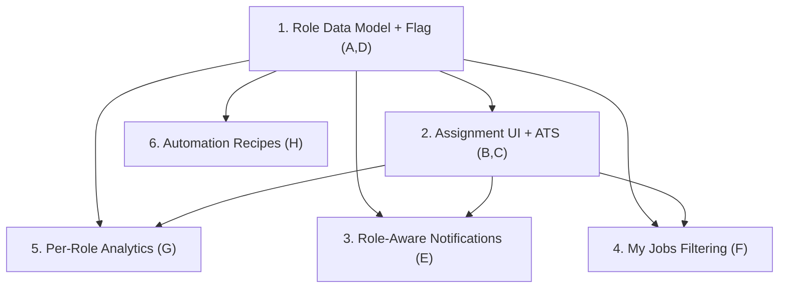

# PHEM-2109151 — Functional Specs Index

Granular Functional Specification Documents (FRDs) derived from Epic **[PHEM-2109151 — Phase 1: Recruiter-Family Roles, Notification Framework & Analytics](https://phenompeople.atlassian.net/browse/PHEM-2109151)**.

The epic introduces granular recruiter-family job-level roles — **Primary Recruiter, Secondary Recruiter, Sourcer, Coordinator** — replacing the single undifferentiated "Recruiter" role, and makes notifications, "My Jobs," and analytics role-aware.

## How the epic was broken down

The epic organizes its requirements into impact areas A–H, each mapped to a workstream/story. These specs are granular per workstream (one specific objective each), so each can be owned, scoped, and reviewed independently by its pod.

| # | Spec | Epic area(s) | Owning pod(s) | Primary customer driver |
|---|------|--------------|---------------|--------------------------|
| 1 | [Recruiter-Family Role Data Model, Registry, Migration & Feature Flag](recruiter-roles-data-model/frd.md) | A, D | CRM + Platform Config | Foundation for all |
| 2 | [Hiring Team Role Assignment UI & ATS Role Mapping](hiring-team-role-assignment/frd.md) | B, C | CRM + Integration Experience | Disney (manual), Allianz (SF pull) |
| 3 | [Role-Aware Notification Framework](role-aware-notifications/frd.md) | E | Notifications / Messaging Platform (NEW) | Allianz (SUP-107507) |
| 4 | ["My Jobs" Role Filtering, Spotlights & Workspace Views](my-jobs-role-filtering/frd.md) | F | CRM | Allianz |
| 5 | [Per-Role Analytics, CRM Events & Report Builder](per-role-analytics/frd.md) | G | Talent Analytics (NEW) | Disney, ThermoFisher |
| 6 | [Role-Aware CRM Automation Recipes](role-aware-automation-recipes/frd.md) | H | Automation Engine (NEW) | Enabler (Allianz, Disney) |

Specs 3, 4, and 5 deliver the three headline customer capabilities (role-aware notifications, "My Jobs" filtering, per-role analytics). Specs 1, 2, and 6 are the enabling foundation.

## Dependency order



## Source Jira items (all read-only)

| Key | Type | Role |
|-----|------|------|
| [PHEM-2109151](https://phenompeople.atlassian.net/browse/PHEM-2109151) | Epic | Primary anchor (Phase 1) |
| [PHEM-1965641](https://phenompeople.atlassian.net/browse/PHEM-1965641) | Initiative | Strategic container / phasing |
| [ASRM-1570](https://phenompeople.atlassian.net/browse/ASRM-1570) | Product Story | Allianz — Primary vs Secondary recruiter |
| [IDPRP-467](https://phenompeople.atlassian.net/browse/IDPRP-467) | Product Story | Disney — Secondary Recruiter / Sourcer / Coordinator + analytics |
| SUP-107507 | Support | Allianz duplicate-notification issue (referenced) |
| [CUSP-5947](https://phenompeople.atlassian.net/browse/CUSP-5947), [CUSP-6045](https://phenompeople.atlassian.net/browse/CUSP-6045) | Product Feedback | Related recruiter-role feedback |
| [PHEM-2014766](https://phenompeople.atlassian.net/browse/PHEM-2014766) | Story | Customer-configurable roles (future direction) |

## Google Docs (published)

Each spec is published as a Google Doc with real Heading 1/2/3 styles, bullet lists, and Jira-ready user stories (User Story / Given-When-Then AC / Localization & Analytics considerations). Re-publish with `python3 tools/build_story_specs.py --apply`.

| # | Spec | Google Doc | Link |
|---|------|------------|------|
| 1 | Recruiter-Family Role Data Model | `13MyVk8NywDj8GI4TQIloE3dK5CuPMfCrGZdMORTirsM` | [open](https://docs.google.com/document/d/13MyVk8NywDj8GI4TQIloE3dK5CuPMfCrGZdMORTirsM/edit) |
| 2 | Hiring Team Role Assignment & ATS Mapping | `1iWkK6ngNsyxKC-Ehn35NTZKsjANezcNNPEkhT6Zvszw` | [open](https://docs.google.com/document/d/1iWkK6ngNsyxKC-Ehn35NTZKsjANezcNNPEkhT6Zvszw/edit) |
| 3 | Role-Aware Notification Framework | `14F8PursKnzFl2-VxzQ0y-7KAUglsdiDHClC6lohNi54` | [open](https://docs.google.com/document/d/14F8PursKnzFl2-VxzQ0y-7KAUglsdiDHClC6lohNi54/edit) |
| 4 | My Jobs Role Filtering & Spotlights | `1yWT0ZZXxexoR9eYjAFBSBmpgH_SoUg7r-jzm9-GSj1A` | [open](https://docs.google.com/document/d/1yWT0ZZXxexoR9eYjAFBSBmpgH_SoUg7r-jzm9-GSj1A/edit) |
| 5 | Per-Role Analytics & Report Builder | `18IkcgFGC9KqfIKgrknybORXxdKInfweZ1jUGYqOk_A0` | [open](https://docs.google.com/document/d/18IkcgFGC9KqfIKgrknybORXxdKInfweZ1jUGYqOk_A0/edit) |
| 6 | Role-Aware CRM Automation Recipes | `1pUTGOIGHzSU0g4qydeeFkajzG53p8PKRpN3m_3byloU` | [open](https://docs.google.com/document/d/1pUTGOIGHzSU0g4qydeeFkajzG53p8PKRpN3m_3byloU/edit) |

Target Drive folder: https://drive.google.com/drive/folders/12y7JmKa0uNhO7Glbc8Q_GLrGaCwoOne-

All 6 specs are placed in the **PHEM-2109151** folder (`CRM Core/PHEM-2109151` on synced Drive).

## Editing a spec and syncing the Google Doc

1. Edit the local `specs/<slug>/frd.md` (keep the markdown structure: `#`/`##`/`###` headings, `-` bullets, plain paragraphs; no markdown tables — use bullets for tabular data).
2. Re-run the styling script to push it into the matching Google Doc with real heading styles:

```bash
# from the SpecDrivenDev/ repo root
python3 tools/format_docs.py                                   # dry run (parse + report only)
python3 tools/format_docs.py --apply                          # restyle all 6 docs
python3 tools/format_docs.py --apply --only my-jobs-role-filtering   # restyle one
```

### How it works / requirements
- The Google ("copilot") MCP must be **connected** in Cursor so a valid OAuth token exists at `~/.copilot/tokens.json` (the script auto-refreshes it near expiry).
- The script (`tools/format_docs.py`) clears each Doc and re-applies native Heading 1/2/3 styles + bullets via the Google Docs API `batchUpdate`. This is required because the Google MCP's `create_google_doc`/`update_google_doc` insert **plain text only** and cannot apply heading styles.
- The slug → Doc ID map lives in both this table and the `DOCS` list at the top of `tools/format_docs.py` — keep them in sync.

### Resuming in a new chat
Open this workspace and point the agent at `specs/` and this README. The file↔doc map and `tools/format_docs.py` are all it needs to continue editing and re-publishing.

> All input Jira items and source documents were read-only. Only these FRD specs and their Google Docs were created/updated.
